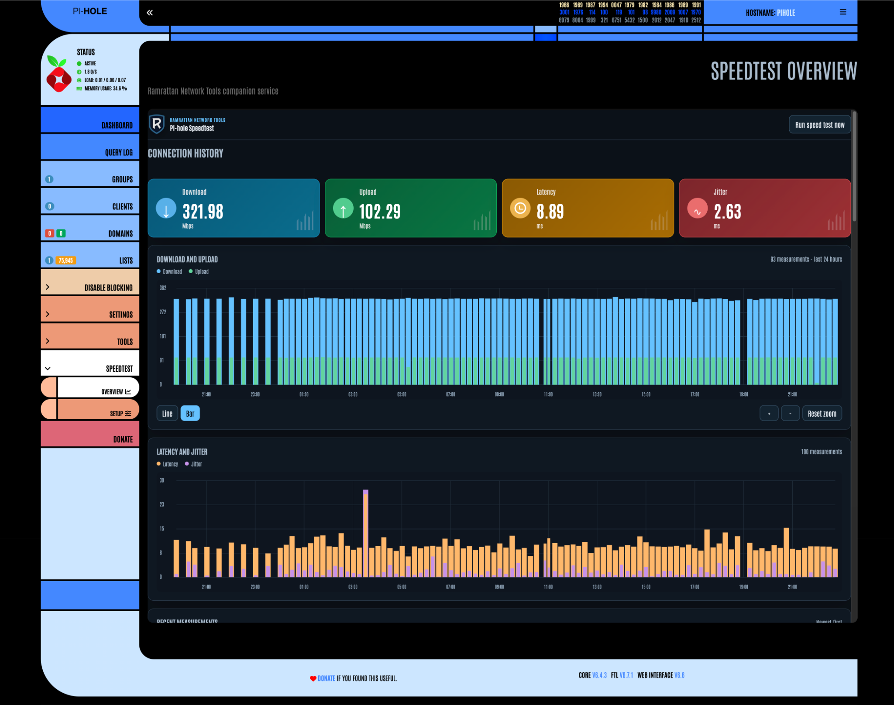
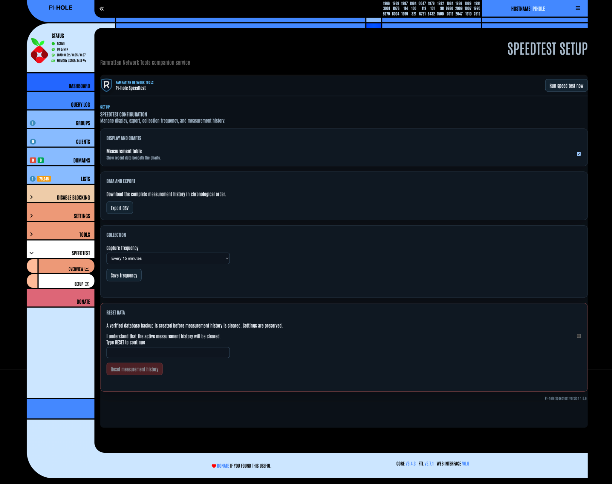

# Pi-hole Speedtest v6

Ramrattan Pi-hole Speedtest is a resilient speed-test companion for Pi-hole v6.
It keeps collection, history, and the full dashboard independent from Pi-hole
so a Pi-hole upgrade cannot erase data or disable scheduled tests.  Optional
sidebar pages open the dashboard from inside the Pi-hole web interface.

> **Release status:** [v1.0.6](https://github.com/RamrattanN/PiHoleSpeedtestV6/releases/tag/v1.0.6)
> is the published production release.  The ordinary install command below
> selects it and passed Raspberry Pi verification.  Stable `v1.0.6` and the
> accepted `v1.0.6-rc.9` point to the same release commit and carry identical
> bootstrap assets.  Earlier release candidates remain published as historical
> evidence.  See the [acceptance record](docs/CURL-INSTALLATION.md#acceptance).

## What it does

Pi-hole shows DNS activity, but it does not keep a scheduled history of your
internet connection's download speed, upload speed, latency, and jitter.  This
companion runs speed tests with the official Ookla CLI, stores results in its
own SQLite database, and puts a connection history in Pi-hole's sidebar.  You
can spot slowdowns and gaps, compare measurements over time, and run a test on
demand.  The collector and dashboard run separately from Pi-hole, so the
history remains available through Pi-hole web updates.

**Overview:** The recent results and zoomable charts show speed, latency, and
jitter together.  Scheduled measurements appear at their intended collection
slots.  Actual start and completion times are retained for inspection and
export.



**Setup:** Choose the collection frequency, show or hide the recent measurement
table, and export the full history as CSV.  Clearing measurement history
requires confirmation and creates a verified database backup first.



The sidebar integration is optional.  The dashboard remains available on its
own port, and uninstall preserves measurements and settings for a later install.

## Quick install

Run as a regular user with `sudo` rights on the Pi-hole host:

```bash
curl -fsSL \
  https://raw.githubusercontent.com/RamrattanN/PiHoleSpeedtestV6/main/install.sh |
  bash
```

This convenience command downloads the current production bootstrap and its
published checksum from the latest GitHub Release, verifies the bootstrap, and
runs it as your user.  The bootstrap downloads the complete release bundle from
an immutable commit, verifies its embedded checksum and source marker, and uses
`sudo` only for privileged phases.  It installs or upgrades the companion,
verifies dashboard health and exactly one collection timer, then adds the
Pi-hole sidebar pages.  Adding `install` after `bash -s --` is equivalent.

## Quick uninstall

```bash
curl -fsSL \
  https://raw.githubusercontent.com/RamrattanN/PiHoleSpeedtestV6/main/install.sh |
  bash -s -- uninstall
```

Uninstall removes the sidebar pages first, verifies that the original Pi-hole
web files are restored, and then removes the companion application, services,
timer, and service account.  Measurement history, settings, backups, logs,
manifests, and recovery evidence are preserved under
`/var/lib/pihole-speedtest`, and a later install reuses them.  Permanent data
deletion is a separate, explicitly confirmed action described in the
[checksum-verified curl workflow](docs/CURL-INSTALLATION.md).

## After installation

The installer prints the addresses it detected for this device.  For a Pi-hole
configured with HTTPS and `/etc/pihole/tls.pem`, the companion also uses HTTPS
and the same Pi-hole hostname.  Otherwise, the normal HTTP addresses are:

- **Dashboard:** `http://<pi-hole-address>:8765/`
- **Pi-hole Overview:** `http://<pi-hole-address>/admin/speedtest`
- **Pi-hole Setup:** `http://<pi-hole-address>/admin/speedtest-setup`

Measurements are collected every 15 minutes by default.  A hostname, HTTPS,
reverse proxy, or nonstandard origin can be supplied with
`--pihole-origin` and `--companion-url` after `bash -s -- install`.

Version 1.0.6 rc.4 and later records the UTC time when each speed test process
starts.  Scheduled tests also record their quarter-hour collection slot (or
the configured interval's slot), which places them on both charts at the exact
schedule boundary.  Manual tests use their actual start time.  The original
`recorded_at` value still records completion and remains available in the API
and CSV export as `completed_at`.  Results captured before rc.4 have no known
start or scheduled time; their charts continue to use their existing completion
time, and the table labels their start as unknown.  The visible-range y-axis
scaling and zoom-responsive bar widths accepted in rc.3 remain unchanged.

## Fully pinned installation

The convenience command trusts the latest stable GitHub Release for the
bootstrap and its checksum.  For independently pinned installation, use the
immutable commands, trust anchors, and recovery contract in the
[checksum-verified curl workflow](docs/CURL-INSTALLATION.md).

## Pinned release selection

To reproduce the accepted rc.9 installation, select its exact release tag.
The ordinary command above selects stable v1.0.6:

```bash
curl -fsSL \
  https://raw.githubusercontent.com/RamrattanN/PiHoleSpeedtestV6/main/install.sh |
  PIHOLE_SPEEDTEST_RELEASE_TAG=v1.0.6-rc.9 bash
```

The tag rules, uninstall form, and full release sequence are in the
[checksum-verified curl workflow](docs/CURL-INSTALLATION.md#release-selection).

## Supported environment

- Pi-hole Core v6 with systemd on an `aarch64` or `x86_64` Debian-family host,
  such as Raspberry Pi OS 64-bit;
- Pi-hole Web v6.6 with its approved sidebar for the sidebar pages;
- Python 3.9 or newer;
- the official Ookla CLI at `/usr/bin/speedtest`;
- a regular user account with `sudo` rights.

Docker deployment is not supported in this release; it is planned future work.
An experimental [Docker Compose setup](docs/DOCKER.md) is available for
review.  It has not been verified on a Docker host and is not part of the
production v1.0.6 support or release.

## Current status

Version `1.0.6` is the published, owner-accepted production baseline on the
verified Raspberry Pi.  The tagged rc.9 install, repeat install, uninstall,
reinstall, scheduled collection, and owner Overview and Setup review passed.
The ordinary stable runner also exited successfully after validating the
published bootstrap.  Version `1.0.5` and rc.1 through rc.8 remain historical
release evidence.  Version `1.0.6`
carries the accepted version `1.0.5` Pi-hole-aligned
chart presentation, the rc.3 zoom corrections, and rc.4 scheduled-slot and
start-time chronology while retaining completion timestamps, rc.5 HTTPS
support for the companion, the rc.6 scheme-aware adapter evidence and recovery
corrections, the rc.7 adaptive HTTP and HTTPS wrapper behavior, the rc.8
LCARS typography, and rc.9 heading correction.
It adds canonical third-party notices, the one-line runner, and the
`install-all` and `uninstall-all` bootstrap actions, and corrects collection
scheduling so a 15-minute setting collects on every 15-minute timer run,
while preserving existing settings, measurement history, and sidebar
integration.  The product provides:

- an official Ookla CLI collector;
- validated result parsing;
- SQLite history;
- a repeatable importer for valid legacy CSV history;
- a local API and Ramrattan Network Tools dashboard;
- local web assets with no CDN dependency;
- line and adaptive layered-bar charts with fixed-scale time-axis zoom and pan;
- true timestamp spacing with substantial collection outages rendered as
  blank chart intervals without altering stored measurements;
- chart mouseover details for measurement time and values;
- optional table visibility and complete-history CSV export;
- dashboard controls for manual speed tests, collection-frequency changes,
  and reset;
- a verified SQLite recovery backup before every reset;
- unprivileged systemd service and schedule assets;
- a version-gated, recovery-backed Pi-hole Web v6.6 sidebar adapter;
- automated unit tests and pull-request CI.

The approved companion service, 15-minute collection timer, and reversible
Pi-hole Web v6.6 sidebar adapter are running on the verified Raspberry Pi 3
baseline.  Version `1.0.5` replaced the irregular mixed-cadence default with a
Pi-hole-style 24-hour chart, responsive hourly grid, uniform bar geometry, and
blank outage intervals while retaining zoom access to older history.  It also
corrects post-install cleanup so a successful installation cannot be reported
as failed.  The checksum-verified
uninstaller discovers and validates the installed source commit, allowing the
current bootstrap to remove any supported installed version.
Guarded installation and upgrade paths exist.  Immutable download
commands and checksums are documented in
[Checksum-verified curl workflow](docs/CURL-INSTALLATION.md).

## Architecture

The product has two deliberately separate layers:

1. **Companion core:** collection, SQLite history, API, dashboard, service,
   scheduling, upgrades, and recovery.
2. **Optional Pi-hole adapter:** a small status card or navigation link.  If a
   Pi-hole update breaks the adapter, the companion core continues to work.

See [Architecture](docs/ARCHITECTURE.md),
[Approved Dashboard Baseline](docs/APPROVED-DASHBOARD-BASELINE.md),
[Pi-hole v6 Adapter](docs/PIHOLE-V6-ADAPTER.md),
[Checksum-verified curl workflow](docs/CURL-INSTALLATION.md),
[QA and Acceptance](docs/QA-AND-ACCEPTANCE.md), and
[Roadmap](docs/ROADMAP.md).  The repository documentation index is
[Wiki](docs/WIKI.md), and active work is summarized in
[Kanban](docs/KANBAN.md).

## Developer quick start

Python 3.11 or newer is recommended.  The runtime uses only the Python standard
library.

```bash
python3 -m venv .venv
source .venv/bin/activate
python -m pip install -e .
python -m unittest discover -s tests -v
```

Collect one measurement with the official Ookla CLI:

```bash
pihole-speedtest collect --database ./data/speedtest.db
```

Import a legacy CSV into a separate development database:

```bash
pihole-speedtest import-legacy-csv \
  ./speedtest.csv \
  --database ./data/imported-speedtest.db
```

The importer reports inserted, duplicate, timestamp-collision, and rejected
rows.  Distinct measurements that share a legacy timestamp are preserved and
reported rather than overwritten.  It returns exit code `2` when a row is
rejected or a timestamp collision is first imported so the migration requires
explicit review.  Running the same import again does not duplicate matching
measurements.

Start the companion dashboard:

```bash
pihole-speedtest serve \
  --database ./data/speedtest.db \
  --host 127.0.0.1 \
  --port 8765
```

Then open <http://127.0.0.1:8765/>.

## Raspberry Pi safety boundary

Development and automated tests run away from the live Pi-hole first.  The
approved companion is installed on the owner's Pi-hole host only through guarded,
recovery-backed gates.  The optional sidebar adapter is managed as a separate,
reversible deployment phase and has completed live owner acceptance.  The
verified device baseline is recorded in
[Verified Raspberry Pi Baseline](docs/VERIFIED-PI-BASELINE.md).

## License

Ramrattan Pi-hole Speedtest is MIT licensed by Nilesh Ramrattan.  See
[LICENSE](LICENSE).

See [Third-Party Notices](THIRD_PARTY_NOTICES.md) for licences applicable to
incorporated components.
